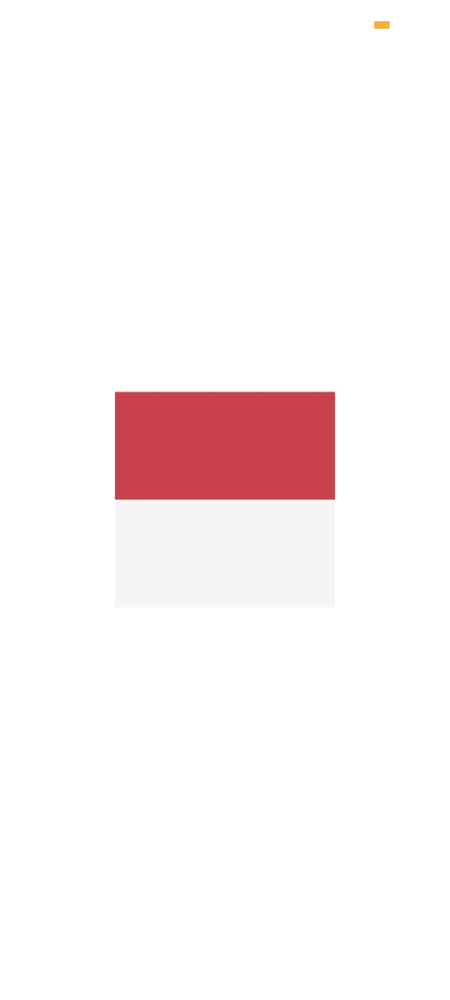
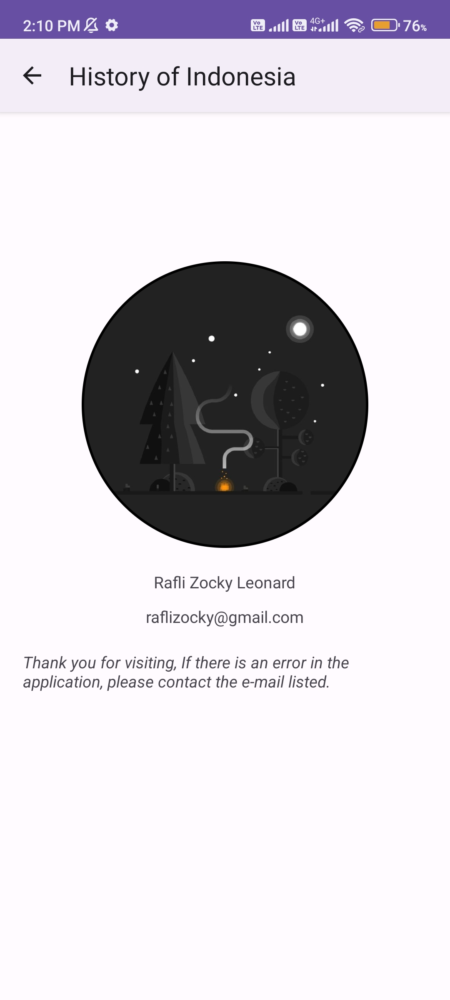
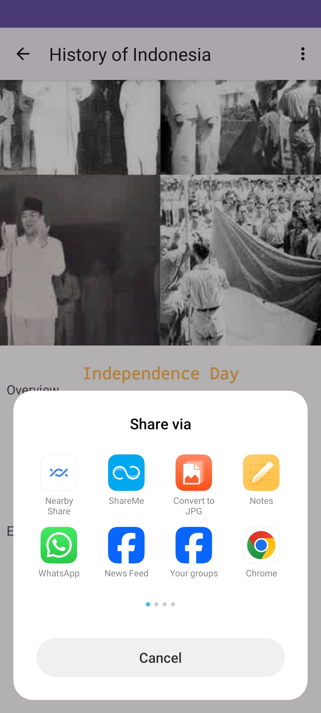
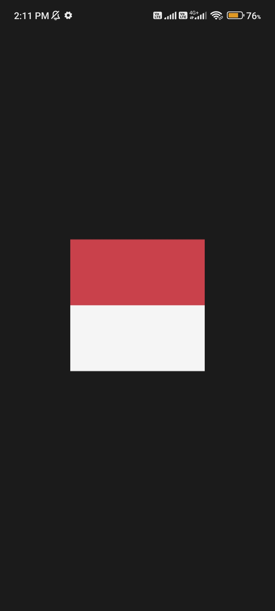
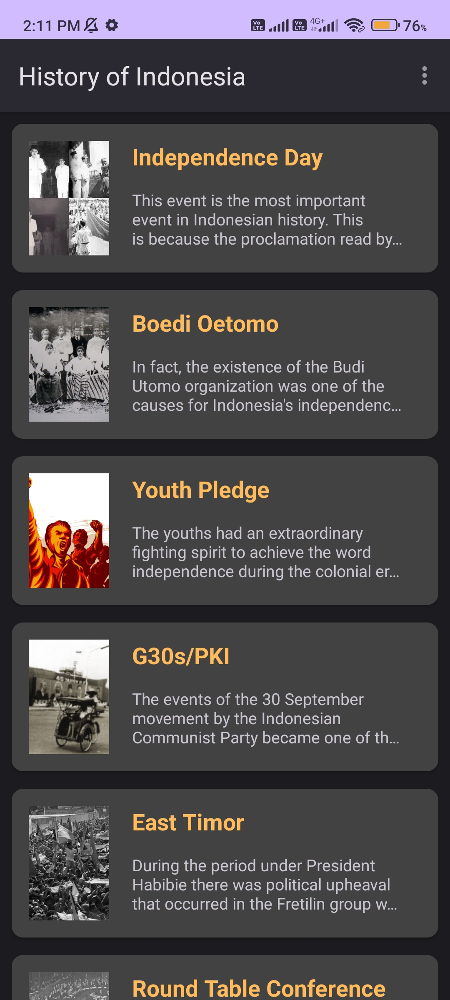
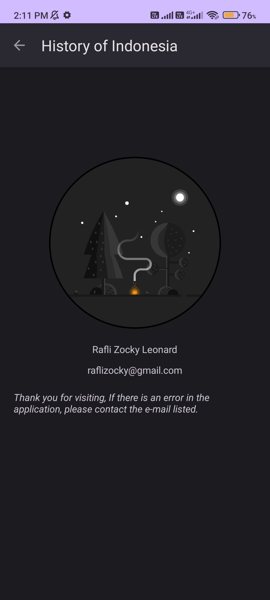
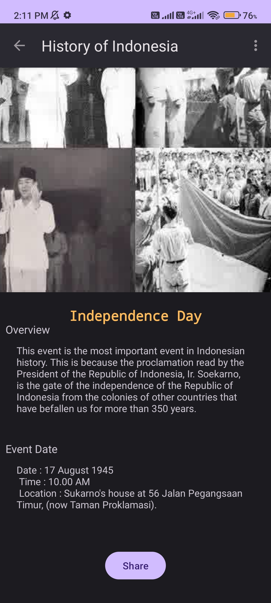
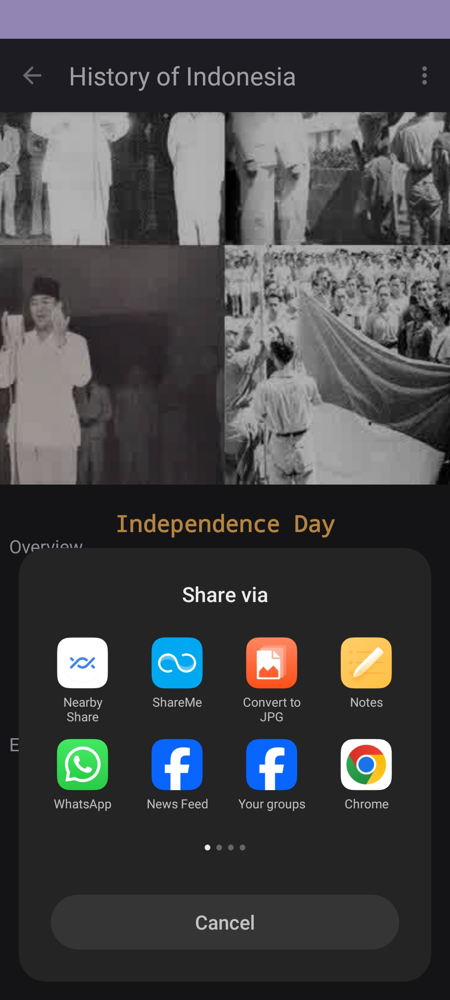

# history-app

The app is built using simple Android components and libraries, such as Recycler View and Glide. Feel free to enhance this repository by submitting pull requests that introduce new features or showcase library usage. Feel free to enhance this repository by submitting pull requests that introduce new features or showcase library usage. Your support, whether through starring or forking this repository, is greatly appreciated!

---

## Installation
Download and install beta version [here](https://github.com/raflizocky/history-app/releases/download/v1.0-beta/app-debug.apk)

---

## Demo    
<h3 align="center"> Light Mode </h3>

    
    
    
    
   
    
    

<h3 align="center"> Dark Mode </h3>

    
    
    
    
   
    
    

