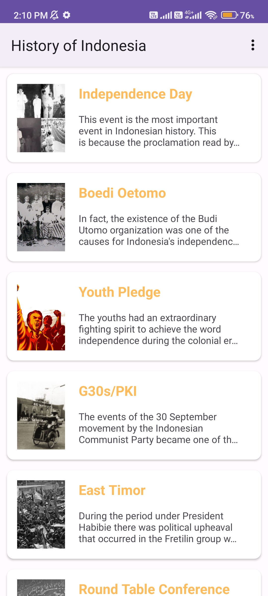

# History of Indonesia

Journey through Indonesia's rich history with this intuitive app, exploring and sharing pivotal moments that shaped the nation. The app is built using simple Android components and libraries, such as Recycler View and Glide.

Feel free to enhance this repository by submitting pull requests that introduce new features or showcase library usage. Your support, whether through starring or forking this repository, is greatly appreciated!

For any further inquiries, feel free to reach out to me on [LinkedIn](https://www.linkedin.com/in/raflizockyleonard) or via email at raflizocky@gmail.com.

---

## Demo    
<h3 align="center"> Light Mode </h3>

    
    
    
    
   
    
    

<h3 align="center"> Dark Mode </h3>

    
    
    
    
   
    
    

