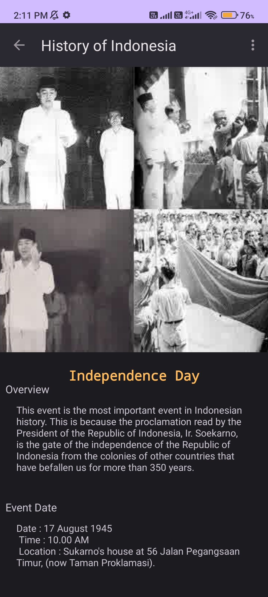

# Overview   
This app provides a simple interface to explore and share historical events, guiding users through Indonesia's rich history.

## Installation 
Clone this repository and import into Android Studio    
```
    https://github.com/raflizocky/history-app.git
```    

## Demo    
<h3 align="center"> Light Mode </h3>
<p align="center">
    
    
    
    
  <br/>
    
    
</p>

<h3 align="center"> Dark Mode </h3>
<p align="center">
    
    
    
    
  <br/>
    
    
</p>

## Pull Requests
Feel free to contribute to this repository by creating pull requests to add new features or demonstrate library usage.

## Support Me
> Just **star** or **fork** this repository and follow my GitHub. Your support means a lot!
    
## Author
[**Rafli Zocky Leonard**](https://www.linkedin.com/in/raflizockyleonard/) - raflizocky@gmail.com

## License 
```

   Copyright © 2023 Rafli Zocky Leonard

   Licensed under the Apache License, Version 2.0 (the "License");
   you may not use this file except in compliance with the License.
   You may obtain a copy of the License at

       http://www.apache.org/licenses/LICENSE-2.0

   Unless required by applicable law or agreed to in writing, software
   distributed under the License is distributed on an "AS IS" BASIS,
   WITHOUT WARRANTIES OR CONDITIONS OF ANY KIND, either express or implied.
   See the License for the specific language governing permissions and
   limitations under the License.

``` 